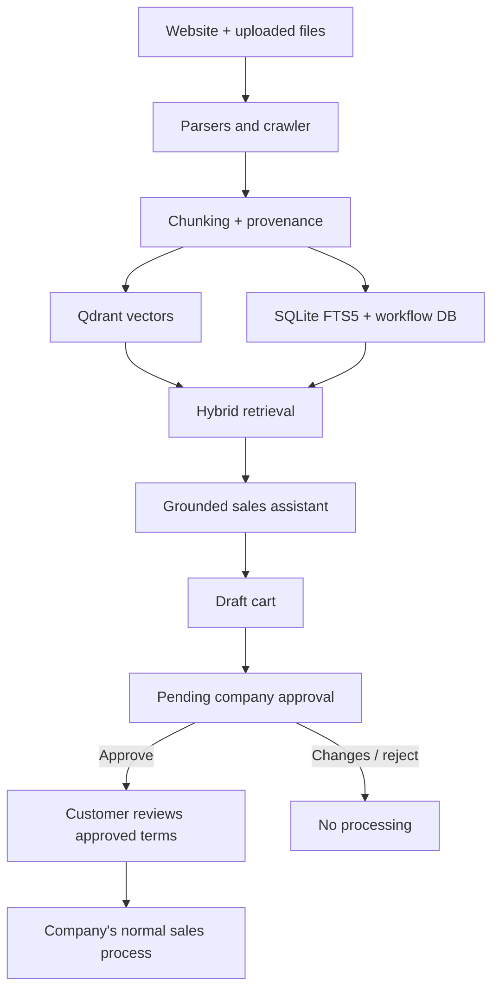

# OMDI Sales RAG

A reusable, multi-company sales assistant that can crawl a public website, ingest
company documents, answer with citations, recommend evidence-backed products, and
prepare a quote/order request. Every submitted request is blocked at
`pending_company_approval` until a company reviewer approves it.

The repository includes Yiğit Alüminyum as the first example company, using the
supplied LED/PVC price lists and product-image XLSX.

## What is implemented

- Website crawling with same-domain limits, `robots.txt`, response-size controls, and
  private-network/SSRF blocking.
- PDF, DOCX, XLSX, CSV, TXT, Markdown, HTML, and JSON ingestion.
- Automatic product-image extraction from SKU-labelled PDF pages and image-anchored
  XLSX rows.
- Qdrant semantic vector search plus SQLite FTS5 keyword/SKU search.
- Intent-aware retrieval for catalog overviews, exact product codes, and short
  conversational follow-ups.
- Per-company source isolation, checksums, authority scores, page/section provenance,
  and citations.
- OpenAI-compatible adapters for both chat and embeddings. This supports OpenAI,
  vLLM, LM Studio, Ollama's compatible endpoint, or another `/v1` API.
- Offline hash embeddings and a mock chat provider for a credential-free smoke demo.
- Consultative sales behavior without fake urgency or unsupported claims.
- Cart and quote-request UI.
- Company notification by signed webhook, SMTP email, or a local durable outbox.
- Admin review actions: approve, request changes, or reject.
- Customer confirmation only after company approval.
- No card collection, automatic payment, stock reservation, manufacturing, shipping,
  or fulfillment.

## Architecture



## Quick start with Docker

1. Create the environment file:

   ```bash
   cp .env.example .env
   ```

2. Change at least `ADMIN_API_KEY` and `ORDER_ACTION_SECRET` in `.env`.

3. Build and start the app and Qdrant:

   ```bash
   docker compose up -d --build
   ```

4. Bootstrap Yiğit Alüminyum and index the supplied files:

   ```bash
   docker compose exec app python scripts/bootstrap_company.py \
     --config sample_data/yigit-aluminium/company.json
   ```

   Add `--scrape` when the running environment is allowed to crawl the public website:

   ```bash
   docker compose exec app python scripts/bootstrap_company.py \
     --config sample_data/yigit-aluminium/company.json \
     --scrape
   ```

5. Open:

   - Chat UI: http://localhost:8000/?company=yigit-aluminium
   - API docs: http://localhost:8000/docs
   - Qdrant dashboard: http://localhost:6333/dashboard

Click **Admin** in the UI and enter the configured `ADMIN_API_KEY` to upload more
documents, crawl a site, and review pending requests.

## Telegram channel

The optional Telegram service uses long polling, so local development does not need
a public webhook, HTTPS certificate, or inbound port.

1. Open [@BotFather](https://t.me/BotFather), run `/newbot`, and copy the generated
   token.

2. Add these values to `.env`:

   ```dotenv
   TELEGRAM_BOT_TOKEN=YOUR_TELEGRAM_BOT_TOKEN
   TELEGRAM_DEFAULT_COMPANY_SLUG=yigit-aluminium
   TELEGRAM_PUBLIC_BASE_URL=http://localhost:8000
   ```

   `TELEGRAM_PUBLIC_BASE_URL` is used only for quote/order links. Set it to the
   deployed public URL before serving customers outside your computer. Keep the bot
   token secret and never commit `.env`.

3. Start the optional service:

   ```bash
   docker compose --profile telegram up -d --build telegram
   ```

4. Check startup:

   ```bash
   docker compose logs -f telegram
   ```

5. Open the bot in Telegram, press **Start**, and ask a product question.

Telegram conversations are mapped to the same RAG chat API and survive bot restarts.
Customer messages stay conversational: technical source lists and duplicate recommendation
cards are hidden on Telegram. When an exact product code is requested, the bot sends the
matching product image when one was extracted from an uploaded PDF or XLSX catalog. When
the assistant offers a quote, Telegram links to the existing web cart; submission still
creates only a `pending_company_approval` request.

Available bot commands:

- `/start` or `/new` starts a fresh conversation.
- `/company <slug>` switches to another configured company.
- `/web` opens the selected company's web assistant.
- `/help` displays command help.

For a non-Docker run, set `TELEGRAM_APP_BASE_URL=http://localhost:8000` and execute:

```bash
python scripts/telegram_bot.py
```

### Corporate TLS inspection

If a company firewall or proxy replaces public HTTPS certificates, export its public
root certificate in PEM/Base-64 format and save it as
`certs/company-root-ca.crt`. The Docker image automatically adds `.crt` files from
that directory to its system trust store. Never put a private key there.

## Response quality rules

- Broad questions such as “What products do you offer?” retrieve category-level
  evidence and do not treat a few matching SKUs as the entire catalog.
- Product listings are not described as current stock unless a source explicitly
  provides inventory evidence.
- Default answers are short and use everyday language.
- Source conflicts are mentioned only when they affect the customer's current
  question.
- Quote and company-approval wording appears only after buying intent is shown.
- Contact information and delivery addresses are collected in the quote form, not chat.
- The chat model runs at temperature `0` to reduce unnecessary variation.

## Product images

During ingestion, the application looks for exact product codes such as `Y6336`.

- On XLSX files, embedded images are mapped to the product code found on the image's
  anchored row.
- On PDF files, suitable images are mapped when a page contains one unambiguous product
  code.
- Normalized customer previews are stored under `DATA_DIR/product-media`.
- Telegram uploads the image bytes directly, so Telegram's servers do not need access to
  the local web application.

Re-running the bootstrap command also extracts images from sources that were already
indexed:

```bash
docker compose exec app python scripts/bootstrap_company.py \
  --config sample_data/yigit-aluminium/company.json
```

## Connect your local vLLM and embedding services

The project defaults to an offline smoke mode. For your existing OpenAI-compatible
vLLM and Qwen embedding endpoints, update `.env`:

```dotenv
LLM_PROVIDER=openai
LLM_BASE_URL=http://YOUR_LLM_HOST:PORT/v1
LLM_API_KEY=dummy
LLM_MODEL=YOUR_SERVED_MODEL_ID
LLM_JSON_MODE=true

EMBEDDING_PROVIDER=openai
EMBEDDING_BASE_URL=http://YOUR_EMBEDDING_HOST:PORT/v1
EMBEDDING_API_KEY=dummy
EMBEDDING_MODEL=YOUR_EMBEDDING_MODEL_ID
EMBEDDING_DIMENSIONS=2560
```

Set `EMBEDDING_DIMENSIONS` to the actual dimension returned by your embedding model.
If the dimension changes, use a new `QDRANT_COLLECTION` name or recreate the existing
collection.

If the local model does not support JSON response mode, set `LLM_JSON_MODE=false`.
The prompt still requests JSON and the backend has a safe fallback parser.

## Order state machine

| State | Meaning | Can processing continue? |
| --- | --- | --- |
| `pending_company_approval` | Customer submitted a request; company has not accepted it | No |
| `company_approved` | Company accepted the commercial request/terms | Only customer review can follow |
| `changes_requested` | Company requires edits or clarification | No |
| `rejected` | Company declined | No |
| `customer_confirmed` | Customer accepted the company-approved terms | Hand off to the company's normal process |
| `cancelled` | Request stopped | No |

The API validates transitions server-side. The LLM cannot change order state.

## Company notifications

Notification priority:

1. Company-specific `sales_webhook_url`
2. Global `ORDER_WEBHOOK_URL`
3. SMTP to the company's `sales_email`
4. `DATA_DIR/outbox/<order-id>.json`

Webhook bodies are signed in `X-OMDI-Signature` when
`ORDER_WEBHOOK_SECRET` is configured. Company review links contain an expiring HMAC
token. Production deployments should use HTTPS and a strong secret.

## Add another company

Create another config directory:

```text
sample_data/my-company/
├── company.json
├── catalog.pdf
├── price-list.xlsx
└── policies.docx
```

Use a unique lowercase slug in `company.json`, list each starter source and authority
score, then run:

```bash
python scripts/bootstrap_company.py --config sample_data/my-company/company.json --scrape
```

The web app selects the tenant with `?company=my-company`.

## Data-source policy

- Uploaded official price lists should normally receive higher authority than marketing
  pages, but the company controls those scores.
- Source authority is a retrieval preference, not permission to hide conflicts.
- Commercial facts keep their source/page metadata.
- If price, minimum quantity, length, stock, or delivery facts conflict, the prompt
  requires the assistant to show the conflict and request company confirmation.
- The Yiğit starter data contains known differences documented in
  `sample_data/yigit-aluminium/source_conflicts.md`.

## Development and checks

With Python 3.11+ and Qdrant available:

```bash
python -m venv .venv
source .venv/bin/activate
pip install -e ".[dev]"
pytest
uvicorn app.main:app --reload
```

The standard-library unit suite can also be run with:

```bash
python -m unittest discover -s tests -v
```

## Production checklist

- Replace all default secrets.
- Put the app and Qdrant behind authentication/TLS; do not expose Qdrant publicly.
- SQLite/FTS5 is intended for one application writer. Before using multiple replicas,
  add a PostgreSQL (or equivalent) workflow and full-text-search adapter.
- Configure rate limits, logging, backups, and retention/deletion rules for personal data.
- Confirm that website crawling is permitted and set an identifiable user agent.
- Use a strong multilingual embedding model.
- Review company-specific legal, privacy, return, tax, and sales wording.
- Connect approval to the company's CRM/ERP only after validating signed events and
  implementing idempotency.
